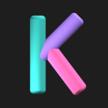

<p align="center">
  </a>
</p>

# Kalabam
[](https://dl.circleci.com/status-badge/redirect/gh/chr-ge/kalabam/tree/master)
> Create Multiplayer Games for Class Activities or Interactive Presentations

## Domains
- [kalabam.com](https://kalabam.com)
- [play.kalabam.com](https://play.kalabam.com)

## Structure
```
app/          -> React Play Game Site
theme/        -> Chakra-UI Theme Shared By App & Website
website/      -> NextJs Website and API
```

## License

Distributed under the MIT license. See `LICENSE` for more information.
